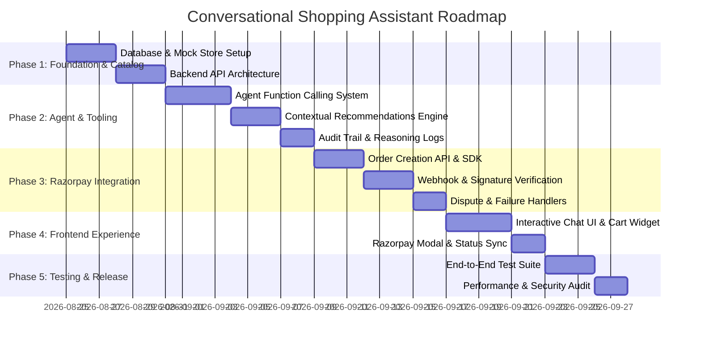

# 🗺️ Implementation Roadmap & Milestones

This phased roadmap outlines the complete development cycle from project bootstrapping to production readiness.

---

## 🎯 Phase 1: Foundation, Catalog & Core API
- [ ] Initialize project stack (Node.js / Express or Fastify / TypeScript backend, React/Vite or Next.js frontend).
- [ ] Implement Product Catalog Schema:
  - Product metadata: `id`, `name`, `description`, `category`, `price`, `currency`, `tags`, `image_url`.
  - Variants: `variant_id`, `size`, `color`, `stock_quantity`, `sku`.
- [ ] Build search & filtering engine (keyword search + semantic vector embeddings for natural queries like "something warm for winter").
- [ ] Build Cart Management Service (Deterministic calculations: subtotal, taxes, shipping, coupon validation).

---

## 🧠 Phase 2: Agent Core, Function Calling & Guardrails
- [ ] Configure Agent Orchestrator with structured tools:
  - `search_catalog(query, filters, price_max)`
  - `get_product_details(product_id)`
  - `manage_cart(action: 'add'|'remove'|'update', variant_id, quantity)`
  - `get_cart_summary()`
  - `suggest_complementary_items(cart_items, max_budget)`
  - `request_checkout_confirmation(cart_id)`
- [ ] Implement Guardrails & Explanations:
  - Pre-execution validation for budget constraints.
  - Natural language reasoning logger (exposing "Why I recommended this" to UI).
  - Activity audit log (saving every state mutation into a session ledger).

---

## 💳 Phase 3: Razorpay Payment Gateway & Trust Pipeline
- [ ] Server-side Razorpay SDK setup with test credentials (`RAZORPAY_KEY_ID`, `RAZORPAY_KEY_SECRET`).
- [ ] Implement secure `create-order` endpoint:
  - Generates Razorpay Order ID linked to cart and user session.
  - Locks inventory temporarily (e.g., 15-minute hold).
- [ ] Implement Webhook receiver & signature verification (`X-Razorpay-Signature` HMAC verification):
  - Handle `payment.captured` -> Confirm order & generate receipt.
  - Handle `payment.failed` -> Notify assistant, unlock stock, offer instant retry.
- [ ] Implement refund & dispute handling utilities.

---

## 🎨 Phase 4: Conversational Frontend & Interactive UI
- [ ] Build chat interface with rich media cards:
  - Product showcase cards with size/color pills.
  - Dynamic Cart Drawer that updates live as the assistant speaks.
  - Live "Reasoning / Thought Process" accordion toggle.
  - Transparent Review & Pay confirmation modal.
- [ ] Integrate Razorpay Standard Checkout SDK (`Razorpay(options).open()`).
- [ ] Implement real-time order status updates (SSE or WebSockets).

---

## 🧪 Phase 5: Security, Testing & Deployment
- [ ] Automated integration tests for edge cases:
  - Out of stock handling.
  - Invalid coupon application.
  - Budget ceiling overflow.
  - Signature forgery rejection.
- [ ] CI/CD pipeline and deployment config (Vercel / AWS / Docker).
