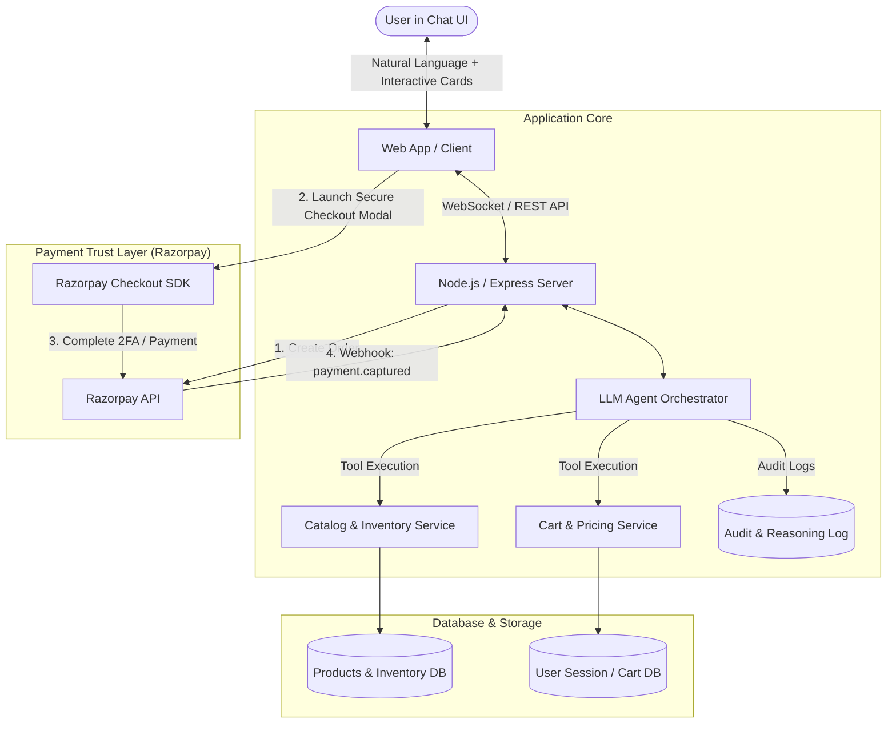
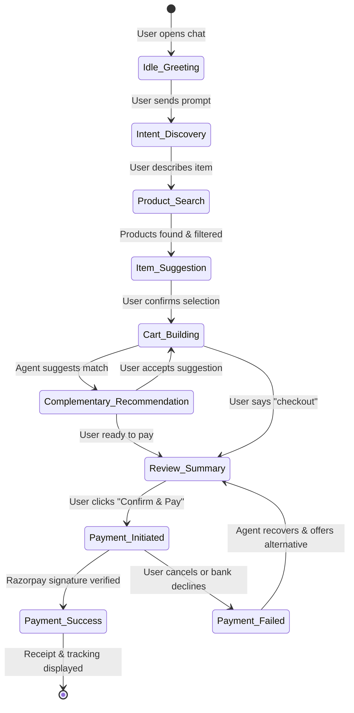

# 🏗️ System Architecture & State Machine

## 1. High-Level Architecture Diagram



---

## 2. Conversational State Machine



---

## 3. Tool Specifications for LLM Agent

The LLM agent interacts with the backend strictly through typed function declarations:

### 1. `search_products`
```json
{
  "name": "search_products",
  "description": "Searches the store catalog by query, category, color, or price range.",
  "parameters": {
    "type": "object",
    "properties": {
      "query": { "type": "string" },
      "category": { "type": "string" },
      "max_price": { "type": "number" },
      "color": { "type": "string" }
    },
    "required": ["query"]
  }
}
```

### 2. `modify_cart`
```json
{
  "name": "modify_cart",
  "description": "Adds, updates quantity, or removes items from the active user cart.",
  "parameters": {
    "type": "object",
    "properties": {
      "action": { "type": "string", "enum": ["add", "remove", "update"] },
      "product_id": { "type": "string" },
      "variant_id": { "type": "string" },
      "quantity": { "type": "integer" }
    },
    "required": ["action", "product_id"]
  }
}
```

### 3. `request_checkout_review`
```json
{
  "name": "request_checkout_review",
  "description": "Renders an explicit, locked order review card for user approval before generating a payment order.",
  "parameters": {
    "type": "object",
    "properties": {
      "customer_notes": { "type": "string" }
    }
  }
}
```

---

## 4. Payment Security & Integrity Flow
1. **Server-Side Price Calculation**: When the user requests checkout, the backend retrieves product prices directly from the database to compute `order_total = sum(item.price * item.quantity) + tax - discount`. The LLM has **no ability to modify the final numeric charge**.
2. **Order Integrity**: A Razorpay Order is generated with `amount = order_total_in_paise` and linked to `order_id` in our database.
3. **HMAC Signature Verification**:
   ```javascript
   const crypto = require('crypto');
   const generated_signature = crypto
     .createHmac('sha256', process.env.RAZORPAY_KEY_SECRET)
     .update(razorpay_order_id + "|" + razorpay_payment_id)
     .digest('hex');

   if (generated_signature === razorpay_signature) {
     // Payment is authentic and verified
   }
   ```
